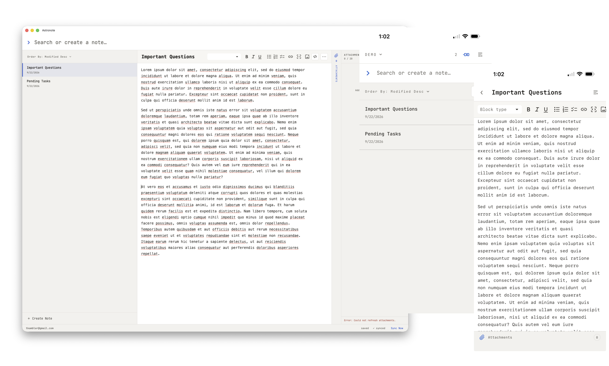

# Astronote

Astronote is a fast, offline-first notes app inspired by Notational Velocity and nValt. It is built around a simple loop: search for a thought, open it, and keep writing. Search and note creation share the same keyboard-friendly workspace, so capturing something new feels as immediate as finding something old. It prioritizes seemless data synchronization across multiple devices (e.g. desktop vs. mobile) and the ability to function while offline.

Notes live on the device first. Astronote remains useful without a network connection, saves edits locally, and synchronizes them when connectivity returns. An account adds private synchronization across devices without turning the server into a requirement for everyday writing.



## What it offers

- A focused interface for quickly creating, searching, and editing notes
- Rich-text and Markdown source editing, plus a diff against the last synchronized version
- Full offline note creation, editing, search, organization, import, and export
- Optional account-based synchronization with conflict preservation
- Tags, collections, pinning, sorting, and appearance preferences
- File attachments and inline images, with cached files available offline
- Shareable read-only notes
- Portable JSON backups and Markdown or text-file imports
- Installable progressive web app behavior with local fonts and an offline app shell

Astronote treats local data as the working copy. The browser stores notes and pending changes in IndexedDB, while PostgreSQL provides authenticated synchronization and durable server storage. If two devices edit the same note, Astronote preserves the local work as a conflict copy instead of silently discarding it.

## Run it locally

You need Node.js 24 or newer and Docker.

```sh
npm install
npm run dev
```

Open [http://localhost:3001](http://localhost:3001). The development command starts PostgreSQL, applies migrations, builds the browser app, and starts the API server.

## Learn more

- [Architecture](ARCHITECTURE.md) explains the system boundaries, offline and sync models, development workflow, testing, and production setup.
- [Deployment](DEPLOYMENT.md) documents the deployment procedure for the hosted Astronote instance.
- While the app is running, API documentation is available at `/api/docs`, with the OpenAPI document at `/api/openapi.json`.
